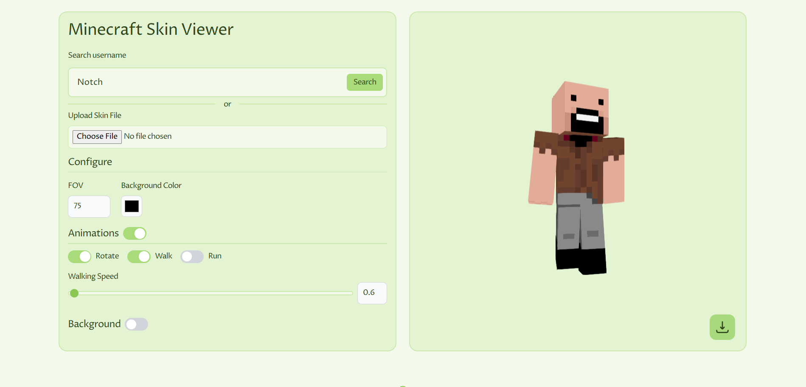

# Minecraft Skin Viewer

A simple Minecraft 3d skin viewer, similar to [NameMC.com](https://namemc.com), where users can:

- Search for a player by name to view and download their skin.
- Upload their own skin file for preview.
- Toggle different animations such as rotating, walking, and running.
- Customize the field of view (FOV) and background color.
- Add a background image using provided options or by uploading their own.
- Set the background image to panorama mode.

This project is just for fun and not meant to be taken too seriously.

**If you'd like to contribute, you're more than welcome!**

### Project Screenshot



### Dependencies

3d Skin Viewer - [skinview3d](https://www.npmjs.com/package/skinview3d)
react-toastify - [react-toastify](https://www.npmjs.com/package/react-toastify)
tailwindcss - [tailwindcss](https://tailwindcss.com)
Tanstack Query - [tanstack query](https://www.npmjs.com/package/@tanstack/react-query)

## Run the Project

First, install the necessary dependencies:

```bash
npm i
```

Then, run the project

```bash
npm run dev
```

The project will be run at [http://localhost:3000](http://localhost:3000). Open with your browser to see the result.
